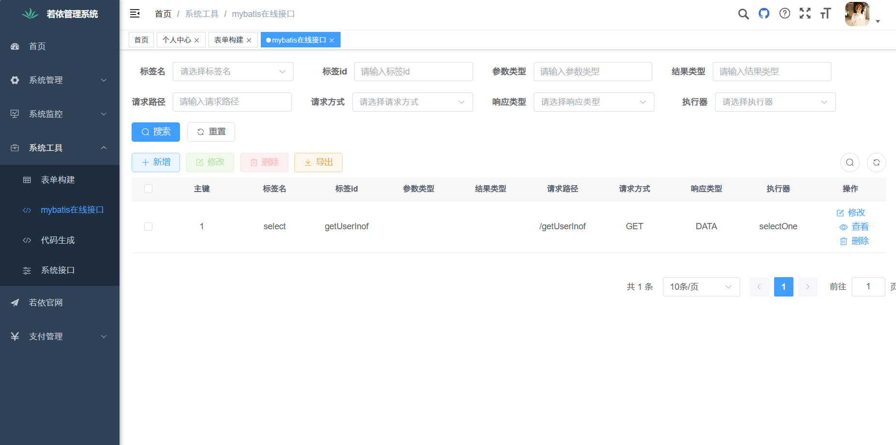
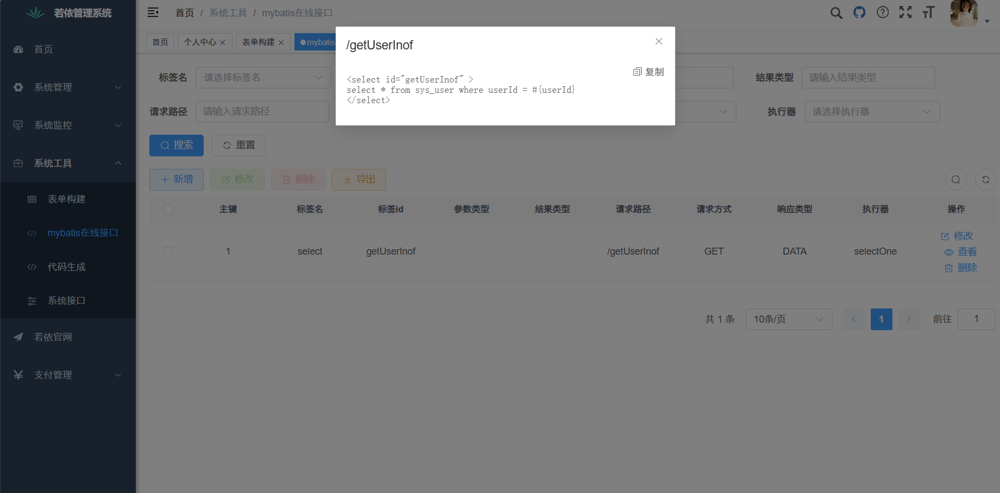
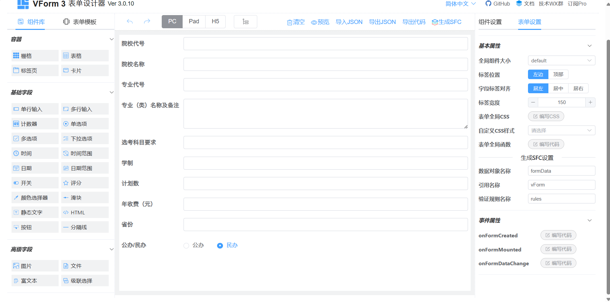
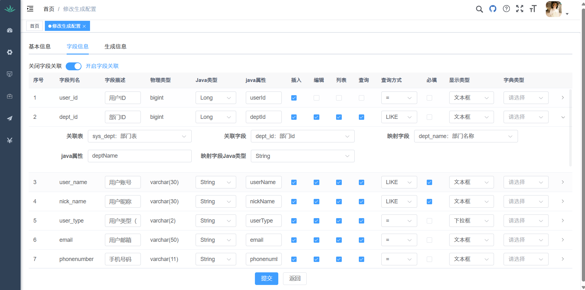
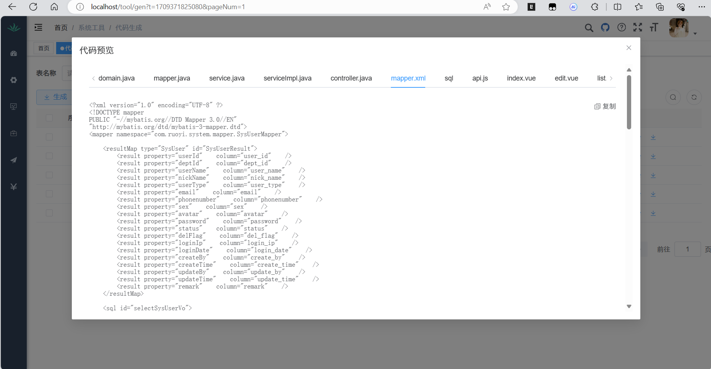

<p align="center">
	
</p>
<h1 align="center" style="margin: 30px 0 30px; font-weight: bold;">RuoYi v3.8.7</h1>
<h4 align="center">基于SpringBoot+Vue前后端分离的Java快速开发框架</h4>
<p align="center">
	<a href="https://gitee.com/y_project/RuoYi-Vue/stargazers"></a>
	<a href="https://gitee.com/y_project/RuoYi-Vue"></a>
	<a href="https://gitee.com/y_project/RuoYi-Vue/blob/master/LICENSE"></a>
</p>

# 当前版本是3.8.7.3.2

本人的其他两个推荐搭配的项目

1. [RuoYi-App-Geek: 这是若依极客生态的小程序版本 (gitee.com)](https://gitee.com/geek-xd/geek-uniapp-vue3-uview-plus-uchart)
2. [RuoYi-Vue3-Geek: 这是若依极客生态的Vue3版本 (gitee.com)](https://gitee.com/geek-xd/ruo-yi-vue3-geek)

与本项目同为一个作者开发，兼容性最好，学习成本最低

## 平台简介

若依是一套全部开源的快速开发平台，毫无保留给个人及企业免费使用。

* 前端采用Vue、Element UI。
* 后端采用Spring Boot、Spring Security、Redis & Jwt。
* 权限认证使用Jwt，支持多终端认证系统。
* 支持加载动态权限菜单，多方式轻松权限控制。
* 高效率开发，使用代码生成器可以一键生成前后端代码。
* 不分离版本，请移步[RuoYi](https://gitee.com/y_project/RuoYi)，微服务版本，请移步[RuoYi-Cloud](https://gitee.com/y_project/RuoYi-Cloud)
* 特别鸣谢：[element](https://github.com/ElemeFE/element)，[vue-element-admin](https://github.com/PanJiaChen/vue-element-admin)，[eladmin-web](https://github.com/elunez/eladmin-web)。
* 阿里云折扣场：[点我进入](http://aly.ruoyi.vip)，腾讯云秒杀场：[点我进入](http://txy.ruoyi.vip)&nbsp;&nbsp;
* 阿里云优惠券：[点我领取](https://www.aliyun.com/minisite/goods?userCode=brki8iof&share_source=copy_link)，腾讯云优惠券：[点我领取](https://cloud.tencent.com/redirect.php?redirect=1025&cps_key=198c8df2ed259157187173bc7f4f32fd&from=console)&nbsp;&nbsp;

## 本项目与原项目的区别

### 核心

**模块化架构设计，支持各个模块的快速安拆，对第三方认证、第三方支付模块设计了基础的规范和基础模块。**

### 细节

1. 改用SpringBoot3+java17的更新的技术栈
2. 升级了代码生成器（配合本项目的vue3版本才可用）
3. 改用最新版本的SpringSecurity安全框架，以及采用最新的lambda 表达式的配置方式
4. 自动Api文档以springfox替代springdoc来适配knife4j框架的4.x版本
5. 引入mybatis-plus增强mybatis
6. RedisConfig实现CachingConfigurer接口代替继承CachingConfigurerSupport类
7. CacheController中RedisCallback的connection.info() 和connection.dbSize()方法已经被弃用，改成通过connection.serverCommands()调用info和db方法，如connection.serverCommands().info()。
8. ExcelUtil中 .newInstance()方法已被弃用，改成.getDeclaredConstructor().newInstance()
9. Excel中roundingMode方法BigDecimal.ROUND_HALF_EVEN改成RoundingMode.HALF_EVEN，用枚举代替常量
10. ReflectUtils中isAccessible在java9中被弃用，建议通过canAccess(null)来代替

## 模块介绍（简单开发必看）

* 最简单的开发就是删除所有的可移除模块，按需添加模块。
* 测试中的模块请自己使用的时候一定要测试一下。
* 开发中的模块请直接删除。

```


com.ruoyi   
├── common            // 工具类
│       └── annotation                    // 自定义注解
│       └── config                        // 全局配置
│       └── constant                      // 通用常量
│       └── core                          // 核心控制
│       └── enums                         // 通用枚举
│       └── exception                     // 通用异常
│       └── filter                        // 过滤器处理
│       └── utils                         // 通用类处理
├── framework         // 框架核心
│       └── aspectj                       // 注解实现
│       └── config                        // 系统配置
│       └── datasource                    // 数据权限
│       └── interceptor                   // 拦截器
│       └── manager                       // 异步处理
│       └── security                      // 权限控制
│       └── web                           // 前端控制
├── ruoyi-generator   // 代码生成（可移除）
├── ruoyi-quartz      // 定时任务（可移除）
├── ruoyi-system      // 系统代码
├── ruoyi-admin       // 后台服务
├── ruoyi-pay         // 支付框架（开发中）
│       └── common                         // 支付框架基础模块（测试中）
│       └── sqb	                           // 收钱吧支付模块（开发中）
│       └── wx	                           // 微信支付模块（待开发）
│       └── alipay	                   // 支付宝支付模块（待开发）
│       └── start	                   // 支付框架整合模块
├── ruoyi-online      // 在线开发模块（可移除）
├── ruoyi-oauth       // 第三方认证框架（测试中）
│       └── common                         // 第三方认证基础模块（开发中）
│       └── justauth                       // 网站第三方认证模块（测试中）
│       └── wx                             // 微信小程序认证模块（测试中）
│       └── phone                          // 手机认证模块（开发中）
│       └── email                          // 邮箱认证模块（待开发）
│       └── start                          // 第三方认证整合模块
```

## 内置功能

1. 用户管理：用户是系统操作者，该功能主要完成系统用户配置。
2. 部门管理：配置系统组织机构（公司、部门、小组），树结构展现支持数据权限。
3. 岗位管理：配置系统用户所属担任职务。
4. 菜单管理：配置系统菜单，操作权限，按钮权限标识等。
5. 角色管理：角色菜单权限分配、设置角色按机构进行数据范围权限划分。
6. 字典管理：对系统中经常使用的一些较为固定的数据进行维护。
7. 参数管理：对系统动态配置常用参数。
8. 通知公告：系统通知公告信息发布维护。
9. 操作日志：系统正常操作日志记录和查询；系统异常信息日志记录和查询。
10. 登录日志：系统登录日志记录查询包含登录异常。
11. 在线用户：当前系统中活跃用户状态监控。
12. 定时任务：在线（添加、修改、删除)任务调度包含执行结果日志。
13. 代码生成：前后端代码的生成（java、html、xml、sql）支持CRUD下载 。
14. 系统接口：根据业务代码自动生成相关的api接口文档。
15. 服务监控：监视当前系统CPU、内存、磁盘、堆栈等相关信息。
16. 缓存监控：对系统的缓存信息查询，命令统计等。
17. 在线构建器：拖动表单元素生成相应的HTML代码。
18. 连接池监视：监视当前系统数据库连接池状态，可进行分析SQL找出系统性能瓶颈。

## 在线体验

- admin/admin123
- 陆陆续续收到一些打赏，为了更好的体验已用于演示服务器升级。谢谢各位小伙伴。

演示地址：http://vue.ruoyi.vip
文档地址：http://doc.ruoyi.vip

## 演示图

### 新加功能和增强功能演示

<table>
    <tr>
        <td></td>
        <td></td>
    </tr>
    <tr>
        <td></td>
        <td></td>
    </tr>
    <tr>
        <td></td>
        <td></td>
    </tr>
</table>

### 原有功能演示

<table>
    <tr>
        <td></td>
        <td></td>
    </tr>
    <tr>
        <td></td>
        <td></td>
    </tr>
    <tr>
        <td></td>
        <td></td>
    </tr>
	<tr>
        <td></td>
        <td></td>
    </tr>	 
    <tr>
        <td></td>
        <td></td>
    </tr>
	<tr>
        <td></td>
        <td></td>
    </tr>
	<tr>
        <td></td>
        <td></td>
    </tr>
    <tr>
        <td></td>
        <td></td>
    </tr>
</table>
